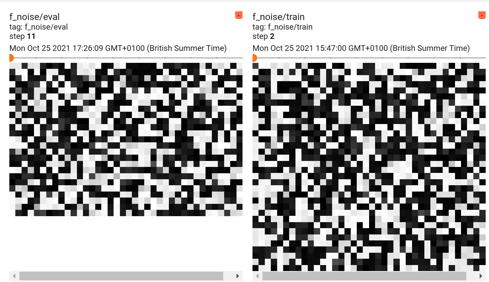
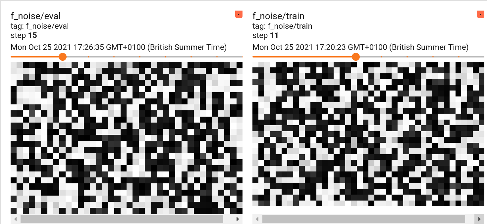
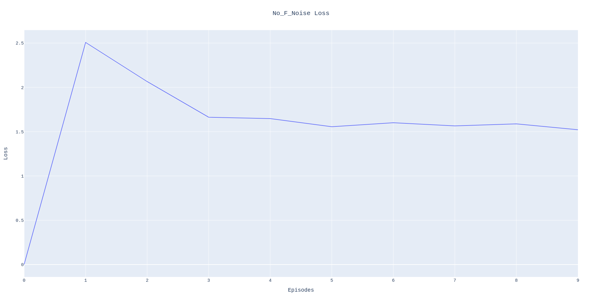
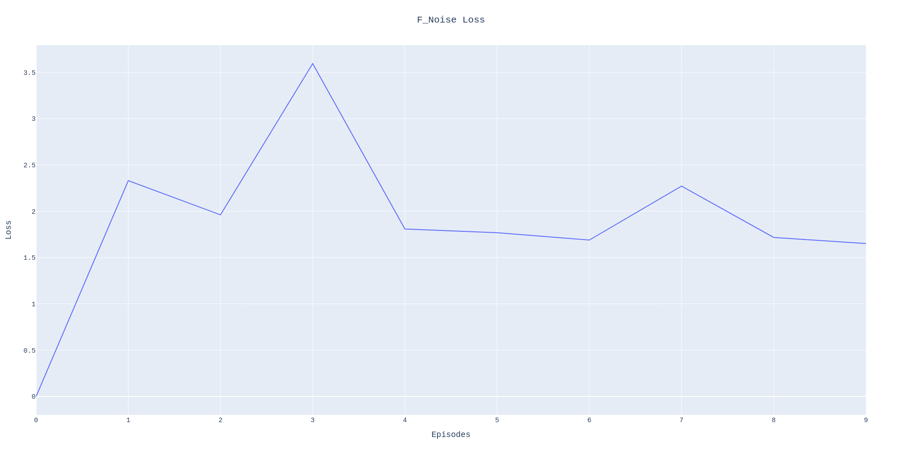

<h1 align="center">
    DeepMirror Internship Interview Phase 2
</h1>

<h2 align="center">
    Add F-Noise to the MaskRCNN backbone
</h2>

## Description
1. Clone a repo containing a state-of-the-art pytorch implementation of the Mask-RCNN architecture. Try to use one that lends itself to net surgery, i.e. a repo that allows you to change individual layers.

2. Download a few samples from the COCO dataset and demonstrate that the chosen implementation is able to learn and perform inferences.

3. Change the network architecture of the Mask-RCNN implementation so that "F-Noise" (i.e. a noise that is proportional to the magnitude of the features in the latent space) is applied to the latent space of the backbone encoder network (the first encoder that is used to predict heat-maps of relevant features). This perturbation should only be applied during training. Bonus points: Visualise the perturbation on the latent space during training & inference.

4. Plot a side by side loss comparison between training with and without F-Noise.

### Task 1
For this task I opted to use the official PyTorch [vision](https://github.com/pytorch/vision) repository. Below I list the architecture used and what functions I have used.

---
I have used the following methods and class from `torchvision.models.detection.backbone_utils.py`:
```
_resnet_fpn_extractor()
_validate_trainable_layers()
BackboneWithFPN()
```

From `torchvision.models.resnet.py` I have used the following:
```
conv3x3()
conv1x1()
Bottleneck()
ResNet()
```

I have also modified the `resnet_50()` method to directly create the model and return it.

I have opted for a resnet50 model which uses a `Bottleneck` layer in its residual layers which has been found to improve accuracy according to this [site](https://ngc.nvidia.com/catalog/model-scripts/nvidia:resnet_50_v1_5_for_pytorch).

Finally from `torchvision.models.detection.mask_rcnn.py` I have used:
```
MaskRCNN()
MaskRCNNHeads()
MaskRCNNPredictor()
```

### Task 2
For this task I download the `references/detection` folder from the [vision](https://github.com/pytorch/vision) repository to enable the use of the COCO dataset as well as functions for training the model.

Because PyTorch DataLoaders stack the images list before passing it to the model this requires all images to have the same shape so in `detections/transforms.py` I added the following code:
```python
class Resize(T.Resize):
    def forward(self, image: Tensor, target: Optional[Dict[str, Tensor]] = None
    ) -> Tuple[Tensor, Optional[Dict[str, Tensor]]]:
        return F.resize(image, self.size, self.interpolation, self.max_size, self.antialias), target
```

Furthermore, I modified the `get_coco()` function in `detection/coco-utils.py` as below to load just a few samples to memory:
```python
def get_coco(root, image_set, transforms, mode="instances", num_samples=110):
    ...
    dataset = torch.utils.data.Subset(dataset, [i for i in range(num_samples)])
    return dataset
```

I also modified the `train_one_epoch()` method to calculate the epoch loss and log it to `tensorboard`.
```python
def train_one_epoch(model, optimizer, data_loader, device, epoch, writer, print_freq):
    ...
    epoch_loss = 0
    for images, targets in metric_logger.log_every(data_loader, print_freq, header):
        ...
        epoch_loss += loss_value
    writer.add_scalar("loss", epoch_loss/len(data_loader), epoch)
```

To train I downloaded the COCO validation dataset from 2014 and loaded only 110 images.  These were split into 88, 22, and 10 for the train, validation and test sets repsectively.  The model was trained for 10 epochs.  This task demonstrated that the model can be trained and that it can perform inferences.

### Task 3
To carry out this task I needed to identify which module needed to be changed so that F-noise can be added to the latent features.
Initially I made changes to the following functions and class:
```python
maskrcnn_resnet50_fpn(..., use_f_noise: bool = False)
_resnet_fpn_extractor(..., use_f_noise)

class BackboneWithFPN():
    def __init__(self, ..., use_f_noise):
        self.use_f_noise = use_f_noise

    def forward(self, x: Tensor) -> Dict[str, Tensor]:
        x = self.body(x)
        if self.use_f_noise:
            # Ordered dict here so final key is last layer
            last_layer = list(x.keys())[-1]
            x_mean = x[last_layer].mean()
            dist = Normal(x_mean, 0.1)
            self.f_noise = dist.sample(sample_shape=x[last_layer].size()[2:])
            
            if self.training:
                x[last_layer] = x[last_layer] + self.f_noise
        
        x = self.fpn(x)
        return x
```

As can be seen from above I interpreted the "magnitude of the latent features" as the mean of the 4D vector BxCxHxW. Since we are adding noise we want to sample values by centering the Normal distribution on the most likely value each element will have in the feature space.  The mean is calculated over all BxCxHxW values.  I interpreted the latent space as the output of the backbone encoder network.

> Another approach to obtaining the magnitude of the features in the latent space could have been the L2 norm of the tensor 

You can see some examples of the perturbations during training and evaluation, inference, of the model.

---




### Task 4
Below I show the loss of the model during 10 epochs of training.

---


